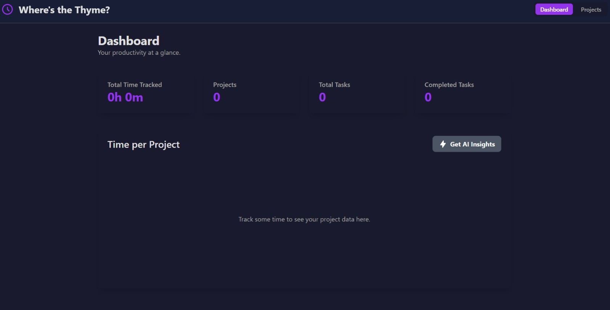

<!-- Improved compatibility of back to top link: See: https://github.com/gwidzy/wheres-the-thyme/pull/73 -->

<!--
*** Thanks for checking out the Best-README-Template. If you have a suggestion
*** that would make this better, please fork the repo and create a pull request
*** or simply open an issue with the tag "enhancement".
*** Don't forget to give the project a star!
*** Thanks again! Now go create something AMAZING! :D
-->

<!-- PROJECT SHIELDS -->
<!--
*** I'm using markdown "reference style" links for readability.
*** Reference links are enclosed in brackets [ ] instead of parentheses ( ).
*** See the bottom of this document for the declaration of the reference variables
*** for contributors-url, forks-url, etc. This is an optional, concise syntax you may use.
*** https://www.markdownguide.org/basic-syntax/#reference-style-links
-->

[![Contributors][contributors-shield]][contributors-url]
[![Forks][forks-shield]][forks-url]
[![Stargazers][stars-shield]][stars-url]
[![Issues][issues-shield]](https://github.com/Gwidzy/wheres-the-thyme/issues)
[![MIT License][license-shield]](https://github.com/Gwidzy/wheres-the-thyme/blob/master/LICENSE.txt)

<!-- PROJECT LOGO -->
 

  

  <h3 align="center">Where's The Thyme?</h3>

  

    A simple tool to help me keep track of life!
     
  

<!-- TABLE OF CONTENTS -->

  
Table of Contents

  <ol>
    <li>
      <a href="#about-the-project">About The Project</a>
      <ul>
        <li><a href="#built-with">Built With</a></li>
      </ul>
    </li>
    <li><a href="#usage">Usage</a></li>
    <li><a href="#license">License</a></li>
    <li><a href="#contact">Contact</a></li>
  </ol>

<!-- ABOUT THE PROJECT -->
## About The Project

I needed an easier way to track and log time for work and personal things. The solution? A simple online tool.

(<a href="#readme-top">back to top</a>)

### Built With

What I used to build this app:
 
 
 &nbsp;
 &nbsp;

(<a href="#readme-top">back to top</a>)

<!-- USAGE EXAMPLES -->
## Usage

 
 

 
 

 
 

 
 

 
 

 
 

(<a href="#readme-top">back to top</a>)

<!-- LICENSE -->
## License

Distributed under the MIT License. See `LICENSE.txt` for more information.

(<a href="#readme-top">back to top</a>)

<!-- CONTACT -->
## Contact

Gwidzy - gwidzy.codes@gmail.com

Project Link: [https://github.com/gwidzy/wheres-the-thyme](https://github.com/gwidzy/wheres-the-thyme)

(<a href="#readme-top">back to top</a>)

<!-- MARKDOWN LINKS & IMAGES -->
<!-- https://www.markdownguide.org/basic-syntax/#reference-style-links -->
[contributors-shield]: https://img.shields.io/github/contributors/gwidzy/wheres-the-thyme.svg?style=for-the-badge
[contributors-url]: https://github.com/gwidzy/wheres-the-thyme/graphs/contributors
[forks-shield]: https://img.shields.io/github/forks/gwidzy/wheres-the-thyme.svg?style=for-the-badge
[forks-url]: https://github.com/gwidzy/wheres-the-thyme/network/members
[stars-shield]: https://img.shields.io/github/stars/gwidzy/wheres-the-thyme.svg?style=for-the-badge
[stars-url]: https://github.com/gwidzy/wheres-the-thyme/stargazers
[issues-shield]: https://img.shields.io/github/issues/gwidzy/wheres-the-thyme.svg?style=for-the-badge
[issues-url]: https://github.com/gwidzy/wheres-the-thyme/issues
[license-shield]: https://img.shields.io/github/license/gwidzy/wheres-the-thyme?style=for-the-badge
[license-url]: https://github.com/Gwidzy/wheres-the-thyme/blob/master/LICENSE.txt
[linkedin-shield]: https://img.shields.io/badge/-LinkedIn-black.svg?style=for-the-badge&logo=linkedin&colorB=555
[linkedin-url]: https://linkedin.com/in/othneildrew
[product-screenshot]: images/screenshot.png
[Next.js]: https://img.shields.io/badge/next.js-000000?style=for-the-badge&logo=nextdotjs&logoColor=white
[Next-url]: https://nextjs.org/
[React.js]: https://img.shields.io/badge/React-20232A?style=for-the-badge&logo=react&logoColor=61DAFB
[React.js]: https://img.shields.io/badge/React-20232A?style=for-the-badge&logo=react&logoColor=61DAFB
[React-url]: https://reactjs.org/
[Vue.js]: https://img.shields.io/badge/Vue.js-35495E?style=for-the-badge&logo=vuedotjs&logoColor=4FC08D
[Vue-url]: https://vuejs.org/
[Angular.io]: https://img.shields.io/badge/Angular-DD0031?style=for-the-badge&logo=angular&logoColor=white
[Angular-url]: https://angular.io/
[Svelte.dev]: https://img.shields.io/badge/Svelte-4A4A55?style=for-the-badge&logo=svelte&logoColor=FF3E00
[Svelte-url]: https://svelte.dev/
[Laravel.com]: https://img.shields.io/badge/Laravel-FF2D20?style=for-the-badge&logo=laravel&logoColor=white
[Laravel-url]: https://laravel.com
[Bootstrap.com]: https://img.shields.io/badge/Bootstrap-563D7C?style=for-the-badge&logo=bootstrap&logoColor=white
[Bootstrap-url]: https://getbootstrap.com
[JQuery.com]: https://img.shields.io/badge/jQuery-0769AD?style=for-the-badge&logo=jquery&logoColor=white
